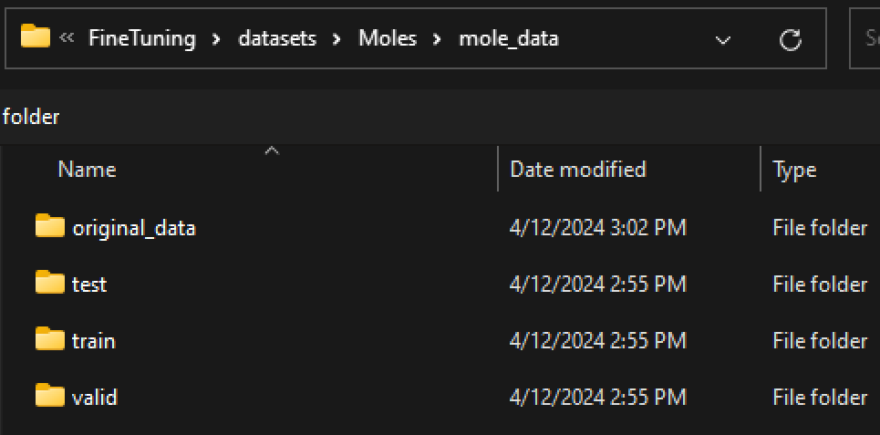
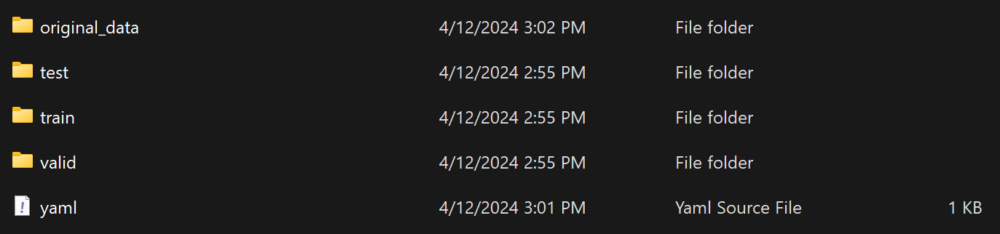
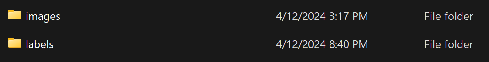
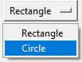

# YAML Annotation Tool

Yet another markup language (YAML) is a common annotation/labeling theme for computer vision and object detection ML models. YAML annotation provides a standardized method for calling out object classification, making fine tuning pre-trained models highly efficient.

## YAML Formatting

YAML files follow the convention, below. The 'yaml_example.yaml' file can provide further context for the structure of yaml documents.

> #Data locations:
>    - train: ../train/images
>    - val: ../valid/images
>    - test: ../test/images

> #Number of categories:
>    - nc: 6

> #Category names
>   - names: ["Scratch", "Dig", "Watermark", "Concave Region", "Convex Region", "Lens Perimeter"]

Data locations refer to the training, validation, and test image directories. It is up to the user to organize and maintain/edit this structure for the application. Additionally, the user can edit the data location structure, so long as the data load is modified accordingly during the model fine tuning stage.

## Annotation Tool: How-To

The [YAML Annotation Tool](annotation.py) is designed to automatically generate and store label files in [Ultraltics YOLO format](https://docs.ultralytics.com/datasets/detect/). The tool also supports real time editing of existing labels for a given directory of labels through the GUI. 

Directory structure is critical for annotation tool functionality. Upon launching the script, File Explorer will prompt the user to select a folder. The user should select the top level folder for the dataset.

The top level data directory should contain the following subfolders, as well as the yaml file.

Each subfolder in the data directory should have the following subfolders:

The annotation tool supports the following shortcuts for navigation and editing:

| Tool               | Controls         | Function     |
|:-------------------|:----------------:|-------------:|
| **Zoom**           | Shift-MouseWheel | resizeImage  |
| **Change Image**   | MouseWheel       | changeImage  |
| **Undo**           | Control-Z        | undo         |
| **Redo**           | Control-Y        | redo         |
| **Drawing Style**  |          | Built into showImage             |
| zebra stripes      | are neat         |              |
| zebra stripes      | are neat         |              |

